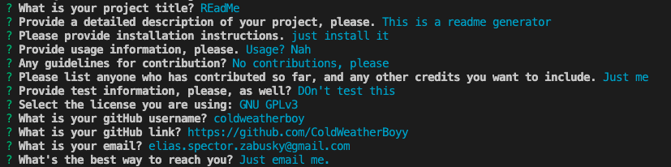

# README Generator

  ## Description
  
  This is a README Generator, designed to save time when creating new projects. It prompts the user using the Inquirer node package for all answers that their README might want, and then creates a new Markdown file. This allowed me to practice ES6 syntax, as well as gain more comfort and knowledge of node.JS

  Video Demo Can Be Found [here](https://drive.google.com/file/d/1wEd6cQCxZyEDYVQ7lFYc64palDNPKT9v/view).
  
  ## Installation
  
  This runs locally, and will require node.JS to be installed, as well as the NPM package Inquirer (any version in the 8s should work, but not 9).
  
  ## Usage
  
  To use, clone the repo locally, and run node index in the appropriate folder. It should then prompt you as needed and create the file from your responses.

  Here's a screenshot of the inquirer in action:

  
  
    
  ## Credits

  Some debugging assistance from [Colin Sprows](https://github.com/ColinSprows) and [Max Ohsawa](https://github.com/maxohsawa).
  

  